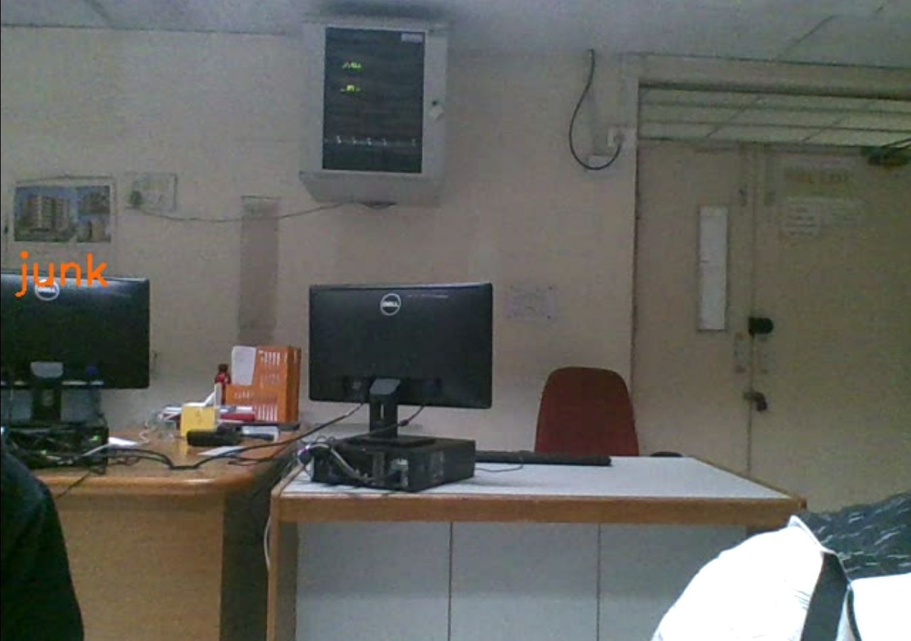
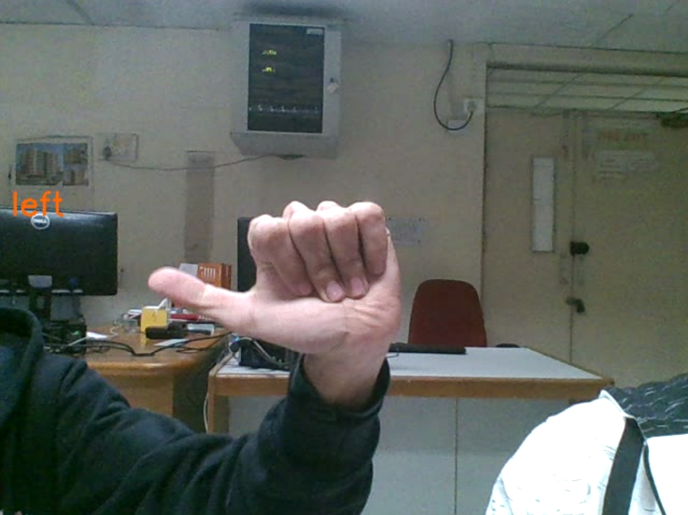
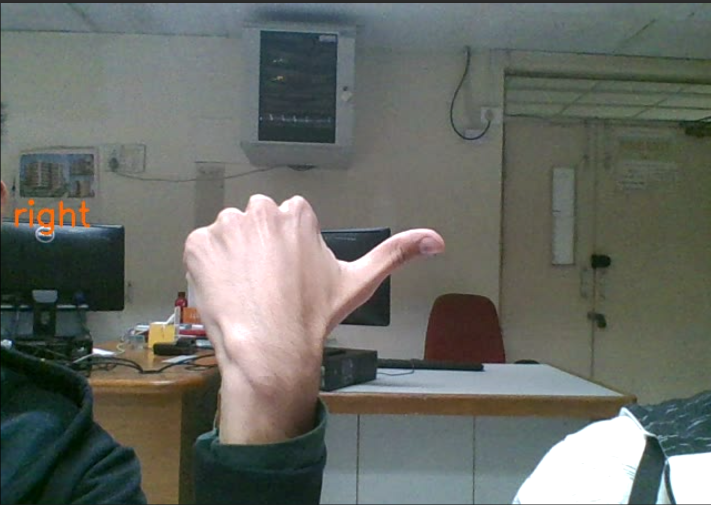

# Hand Gesture Recognition

### Created by:
[Saksham Dhull](https://github.com/Dhull442) and [Shourya Aggarwal](https://github.com/ShouryaAggarwal) for Computer Vision course under Prof. Chetan Arora.

## Introduction
We develop a model that takes pre-processed frames as input and outputs the gesture created by the hand.
Design:
* `Conv2d(1, 6, kernel-size=(3, 3), stride=(1, 1))`: This is a convo-
lution layer with 3 × 3 kernel size and 1 input image channel and 6 output
image channels. There is no particular reason for using this format other
than that it was similar to the one used for mnist.
* `Conv2d(6, 16, kernel-size=(7, 7), stride=(1, 1))`: This is a con-
volution layer which takes 6 channels input and outputs with 1296 features
to the Fully connected layer.
* `Fully connected layers`: It consists of 3 layers, first with 1296 inputs
and 500 outputs second with 500 inputs and 100 outputs and 3rd with
100 inputs and 4 outputs (final result classes). The neurons in each layer
were taken so as to linearly decrease the size of feature map to 4. 

## White Background
* **Pre-processing**: For the training of hand gestures on white background,
we used the images augmented with the corresponding contours drawn
on them, as the training dataset of images. The contours were found out
using simple Canny edge detection.
* **Inferencing**: The live frames taken from webcam were similarly aug-
mented with the contours found out by Canny edge detection, and these
modified frames are given to the trained model for inferencing.

### Screenshots
<table>
<tr>
<td><figure><figcaption>Junk/Nothing recognized</figcaption></figure></td>
<td><figure><figcaption>Stop recognized</figcaption></figure></td>
</tr>
<tr>
<td><figure><figcaption>Left recognized</figcaption></figure></td>
<td><figure><figcaption>Right recognized</figcaption></figure></td>
</tr>
</table>

## Generic Background
* **Pre-processing**: For the training of hand gestures on generic back-
ground, we used colour segmentation to isolate the hand gesture in the
frames, from the rest of the background. A pre-decided range of HSV
colours were speficied to generate a binary mask of image pixels falling in
that range, accompanies by gaussian blurring and morphological opening
to smooth the image and reduce the white pixel noise from the mask.
These masks are obtained from all the images from training data-set and
the model is trained on these masks.
* **Inferencing**: The live frames taken from webcam were similarly masked
between the range of skin colour to obtain the relevant masks. These
2masks obtained are then given to the trained model for inferring. Some-
times the lighting conditions result in the perceived colour of hand skin
to go out of the range during live infer mode, for which we have given the
option to re-calibrate the colour range for current camera conditions.

### Screenshots
<table>
<tr>
<td><figure><figcaption>Junk/Nothing recognized</figcaption></figure></td>
<td><figure><figcaption>Stop recognized</figcaption></figure></td>
</tr>
<tr>
<td><figure><figcaption>Left recognized</figcaption></figure></td>
<td><figure><figcaption>Right recognized</figcaption></figure></td>
</tr>
</table>

